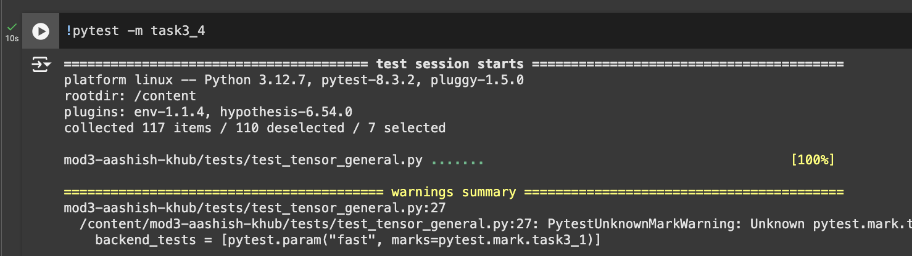

# MiniTorch Module 3


* Docs: https://minitorch.github.io/

* Overview: https://minitorch.github.io/module3.html


You will need to modify `tensor_functions.py` slightly in this assignment.

* Tests:

```
python run_tests.py
```

* Note:

Several of the tests for this assignment will only run if you are on a GPU machine and will not
run on github's test infrastructure. Please follow the instructions to setup up a colab machine
to run these tests.

This assignment requires the following files from the previous assignments. You can get these by running

```bash
python sync_previous_module.py previous-module-dir current-module-dir
```

The files that will be synced are:

        minitorch/tensor_data.py minitorch/tensor_functions.py minitorch/tensor_ops.py minitorch/operators.py minitorch/scalar.py minitorch/scalar_functions.py minitorch/module.py minitorch/autodiff.py minitorch/module.py project/run_manual.py project/run_scalar.py project/run_tensor.py minitorch/operators.py minitorch/module.py minitorch/autodiff.py minitorch/tensor.py minitorch/datasets.py minitorch/testing.py minitorch/optim.py

# Tests for 3.3 and 3.4, as run on Google Colab




# Task 3.4
## Matrix Multiplication comparison
| Size  | Fast (CPU) | GPU      |
|-------|------------|----------|
| 64    | 0.00313    | 0.00568  |
| 128   | 0.01419    | 0.01265  |
| 256   | 0.09297    | 0.04628  |
| 512   | 0.99927    | 0.20169  |
| 1024  | 8.95927    | 0.87069  |


# Task 3.5
Please see below for the logs & time per epoch, as done for each of the following:


| Backend | Dataset | Hidden |
|---------|---------|--------|
| CPU     | SIMPLE  | 100    |
| GPU     | SIMPLE  | 100    |
| CPU     | SPLIT   | 100    |
| GPU     | SPLIT   | 100    |
| CPU     | XOR     | 100    |
| GPU     | XOR     | 100    |
| CPU     | SPLIT   | 200    |
| GPU     | SPLIT   | 200    |


### Backend: CPU & Dataset: SIMPLE
### Hyperparameters & Time per epoch
Size of Hidden Layer: 100

Learning Rate: 0.05

Number of Epochs: 500

Time taken: 91.62 seconds

Time per epoch: 0.18 seconds

### Logs
```markdown
Epoch  0  loss  8.393405397063702 correct 37
Epoch  10  loss  3.672329105418305 correct 45
Epoch  20  loss  1.2325414430079817 correct 50
Epoch  30  loss  1.4741343077682867 correct 50
Epoch  40  loss  1.2678996226669248 correct 50
Epoch  50  loss  1.016261477404936 correct 50
Epoch  60  loss  0.09317639292821338 correct 49
Epoch  70  loss  0.8543043103393979 correct 50
Epoch  80  loss  0.4009798224475859 correct 50
Epoch  90  loss  1.132958315056303 correct 50
Epoch  100  loss  0.5031896871498647 correct 50
Epoch  110  loss  0.2011249773658126 correct 49
Epoch  120  loss  0.8665763741957686 correct 50
Epoch  130  loss  0.2502069882131386 correct 50
Epoch  140  loss  0.09849594425547821 correct 50
Epoch  150  loss  0.9238082219850776 correct 50
Epoch  160  loss  0.028940845628612162 correct 50
Epoch  170  loss  0.15787745173465464 correct 50
Epoch  180  loss  0.5234953970441943 correct 50
Epoch  190  loss  0.3605340640612761 correct 50
Epoch  200  loss  0.4330532567782157 correct 50
Epoch  210  loss  0.45179827720534943 correct 50
Epoch  220  loss  0.2689950919705213 correct 50
Epoch  230  loss  0.18222462077884008 correct 50
Epoch  240  loss  0.3173474950920373 correct 50
Epoch  250  loss  0.22844022434690578 correct 50
Epoch  260  loss  0.10245212586235557 correct 50
Epoch  270  loss  0.6952282581977797 correct 50
Epoch  280  loss  0.31245849113521174 correct 50
Epoch  290  loss  0.46132768517496253 correct 50
Epoch  300  loss  0.36044600056608844 correct 50
Epoch  310  loss  0.9177587665741234 correct 50
Epoch  320  loss  0.3793510781699292 correct 50
Epoch  330  loss  0.22700998962709168 correct 50
Epoch  340  loss  0.07436499965695909 correct 50
Epoch  350  loss  0.11313463066770356 correct 50
Epoch  360  loss  0.21928616996934294 correct 50
Epoch  370  loss  0.4233274463052745 correct 50
Epoch  380  loss  0.1241573842164645 correct 50
Epoch  390  loss  0.1463571037578901 correct 50
Epoch  400  loss  0.09422565508771479 correct 50
Epoch  410  loss  0.053929111836859375 correct 50
Epoch  420  loss  0.5475398904398914 correct 50
Epoch  430  loss  0.02314071888721017 correct 50
Epoch  440  loss  0.2461526931374859 correct 50
Epoch  450  loss  0.23106318966028544 correct 50
Epoch  460  loss  0.1394047665361601 correct 50
Epoch  470  loss  0.08637341233133507 correct 50
Epoch  480  loss  0.2003142149416495 correct 50
Epoch  490  loss  0.13124766777893887 correct 50
```
=======================================
### Backend: GPU & Dataset: SIMPLE
### Hyperparameters & Time per epoch
Size of Hidden Layer: 100

Learning Rate: 0.05

Number of Epochs: 500

Time taken: 821.22 seconds

Time per epoch: 1.64 seconds

### Logs
```markdown
Epoch  0  loss  5.667026649333407 correct 41
Epoch  10  loss  0.7056772706574309 correct 49
Epoch  20  loss  1.0343236886434837 correct 50
Epoch  30  loss  0.8145648036353033 correct 50
Epoch  40  loss  0.6906554996180445 correct 50
Epoch  50  loss  0.22365803316093244 correct 49
Epoch  60  loss  0.2061948233280237 correct 50
Epoch  70  loss  0.0933194231187486 correct 50
Epoch  80  loss  0.7537281774221676 correct 50
Epoch  90  loss  0.08763216378384296 correct 50
Epoch  100  loss  0.05484457101850935 correct 50
Epoch  110  loss  0.5538453570391084 correct 50
Epoch  120  loss  0.8313798989426817 correct 50
Epoch  130  loss  0.45182524157932985 correct 50
Epoch  140  loss  0.33173775905146713 correct 50
Epoch  150  loss  0.5069725383393918 correct 50
Epoch  160  loss  0.14805203541296863 correct 50
Epoch  170  loss  0.4421025773357827 correct 50
Epoch  180  loss  0.0520013502679063 correct 50
Epoch  190  loss  0.5123485588315295 correct 50
Epoch  200  loss  0.0027408651786533923 correct 50
Epoch  210  loss  0.06455823732742093 correct 50
Epoch  220  loss  0.08390819569830033 correct 50
Epoch  230  loss  0.46130866869401255 correct 50
Epoch  240  loss  0.19051751044300885 correct 50
Epoch  250  loss  0.22318638512740394 correct 50
Epoch  260  loss  0.5349405059447513 correct 50
Epoch  270  loss  0.00989751017688178 correct 50
Epoch  280  loss  0.7646425196435026 correct 50
Epoch  290  loss  0.1491462983691823 correct 50
Epoch  300  loss  0.1301320392864083 correct 50
Epoch  310  loss  0.3426433350463707 correct 50
Epoch  320  loss  0.17240929836597435 correct 50
Epoch  330  loss  0.3905869585753064 correct 50
Epoch  340  loss  0.14609880577676165 correct 50
Epoch  350  loss  0.606826428208757 correct 50
Epoch  360  loss  0.38686796435438664 correct 50
Epoch  370  loss  0.20686579053026924 correct 50
Epoch  380  loss  0.03179663257561228 correct 50
Epoch  390  loss  0.2913984704217567 correct 50
Epoch  400  loss  0.20190108679265192 correct 50
Epoch  410  loss  0.08733587673920677 correct 50
Epoch  420  loss  0.10464589936413775 correct 50
Epoch  430  loss  0.0011601788812963469 correct 50
Epoch  440  loss  0.15706741990074735 correct 50
Epoch  450  loss  0.0008209971991524368 correct 50
Epoch  460  loss  0.008070007999252416 correct 50
Epoch  470  loss  0.34568403796925384 correct 50
Epoch  480  loss  0.03030733435438429 correct 50
Epoch  490  loss  0.3727737409433031 correct 50
```
=======================================

### Backend: CPU & Dataset: SPLIT
### Hyperparameters & Time per epoch
Size of Hidden Layer: 100

Learning Rate: 0.05

Number of Epochs: 500

Time taken: 90.57 seconds

Time per epoch: 0.18 seconds

### Logs
```markdown
Epoch  0  loss  4.992608692452502 correct 32
Epoch  10  loss  5.1319976042280135 correct 42
Epoch  20  loss  4.644693633482296 correct 42
Epoch  30  loss  5.081712502926738 correct 37
Epoch  40  loss  4.286520030295278 correct 40
Epoch  50  loss  3.5696709720422084 correct 47
Epoch  60  loss  2.4538154894156565 correct 47
Epoch  70  loss  2.295295315575463 correct 48
Epoch  80  loss  2.420792187720295 correct 48
Epoch  90  loss  2.7075876194126707 correct 47
Epoch  100  loss  2.2494116458486197 correct 49
Epoch  110  loss  2.1132379388095264 correct 48
Epoch  120  loss  2.438531745714449 correct 49
Epoch  130  loss  1.023428147893449 correct 50
Epoch  140  loss  2.3893298516974326 correct 45
Epoch  150  loss  1.2497630976060283 correct 49
Epoch  160  loss  4.057303986942941 correct 46
Epoch  170  loss  1.1681609888089717 correct 50
Epoch  180  loss  2.337064578899671 correct 50
Epoch  190  loss  1.8405083172927683 correct 49
Epoch  200  loss  1.3710387798342905 correct 45
Epoch  210  loss  1.3289949494290136 correct 49
Epoch  220  loss  0.42111596612990915 correct 49
Epoch  230  loss  1.6680042533183324 correct 50
Epoch  240  loss  0.3947095587375417 correct 49
Epoch  250  loss  1.730199069510322 correct 48
Epoch  260  loss  1.2764343800794355 correct 50
Epoch  270  loss  0.8840074443161405 correct 49
Epoch  280  loss  1.6902275442945858 correct 46
Epoch  290  loss  0.4081555438703259 correct 49
Epoch  300  loss  0.3504038146012974 correct 49
Epoch  310  loss  1.3438374261580994 correct 47
Epoch  320  loss  1.8346147911470674 correct 45
Epoch  330  loss  1.5544140355969702 correct 50
Epoch  340  loss  0.8608362934785532 correct 48
Epoch  350  loss  0.5037390865273821 correct 50
Epoch  360  loss  0.6069926151385703 correct 48
Epoch  370  loss  0.3228143671617009 correct 48
Epoch  380  loss  1.2416785912392838 correct 50
Epoch  390  loss  1.2234054895635644 correct 50
Epoch  400  loss  2.24949318415198 correct 46
Epoch  410  loss  0.8472739876791714 correct 49
Epoch  420  loss  0.3915811869198093 correct 49
Epoch  430  loss  0.08010142139295949 correct 48
Epoch  440  loss  0.07115202001228298 correct 48
Epoch  450  loss  0.19046730884313687 correct 48
Epoch  460  loss  1.1480691402251104 correct 50
Epoch  470  loss  0.658832401709355 correct 48
Epoch  480  loss  0.2428977773428901 correct 49
Epoch  490  loss  1.073107243797495 correct 49
```

### Backend: GPU & Dataset: SPLIT
### Hyperparameters & Time per epoch
Size of Hidden Layer: 100

Learning Rate: 0.05

Number of Epochs: 500

Time taken: 823.96 seconds

Time per epoch: 1.65 seconds

### Logs
```markdown
Epoch  0  loss  6.528660064719368 correct 36
Epoch  10  loss  9.827373323038795 correct 45
Epoch  20  loss  6.388108138286099 correct 41
Epoch  30  loss  4.476829524781008 correct 45
Epoch  40  loss  4.850757103101378 correct 42
Epoch  50  loss  2.491381617074033 correct 45
Epoch  60  loss  2.3761358216030892 correct 42
Epoch  70  loss  5.913166747883354 correct 45
Epoch  80  loss  2.258162857850341 correct 45
Epoch  90  loss  2.2332842214988426 correct 45
Epoch  100  loss  3.9685016743596435 correct 47
Epoch  110  loss  2.750639689892814 correct 46
Epoch  120  loss  3.018689729048766 correct 47
Epoch  130  loss  2.3216490538742702 correct 47
Epoch  140  loss  1.5115642364681396 correct 48
Epoch  150  loss  1.4497299224208438 correct 48
Epoch  160  loss  1.6015007259408511 correct 50
Epoch  170  loss  1.1616163923328842 correct 47
Epoch  180  loss  1.0793236135540145 correct 48
Epoch  190  loss  1.8135584572286527 correct 48
Epoch  200  loss  3.2413270430995182 correct 45
Epoch  210  loss  0.40001141071845253 correct 47
Epoch  220  loss  1.261605160660951 correct 50
Epoch  230  loss  1.431410767537737 correct 48
Epoch  240  loss  0.9354246672915925 correct 48
Epoch  250  loss  2.111356543190764 correct 49
Epoch  260  loss  2.646214835881668 correct 46
Epoch  270  loss  2.5665395813481333 correct 49
Epoch  280  loss  0.3857146776626748 correct 50
Epoch  290  loss  1.469330771329544 correct 45
Epoch  300  loss  0.9262417057019274 correct 50
Epoch  310  loss  1.2169893972139705 correct 50
Epoch  320  loss  0.49173381557918383 correct 47
Epoch  330  loss  1.072667887341014 correct 49
Epoch  340  loss  1.0506146075937743 correct 50
Epoch  350  loss  1.7674905334806388 correct 49
Epoch  360  loss  2.262260429808041 correct 49
Epoch  370  loss  0.8380576842731344 correct 50
Epoch  380  loss  0.5114301104344507 correct 50
Epoch  390  loss  1.3237301375824135 correct 46
Epoch  400  loss  0.5325490854779252 correct 50
Epoch  410  loss  1.14417035747582 correct 50
Epoch  420  loss  2.240978827919176 correct 46
Epoch  430  loss  0.9711104649459625 correct 50
Epoch  440  loss  1.559414411987154 correct 50
Epoch  450  loss  0.4795832700137562 correct 50
Epoch  460  loss  0.9158900031704137 correct 50
Epoch  470  loss  0.9231062871367259 correct 49
Epoch  480  loss  1.5742907477140953 correct 50
Epoch  490  loss  0.26775618390742195 correct 49
```

### Backend: CPU & Dataset: XOR
### Hyperparameters & Time per epoch
Size of Hidden Layer: 100

Learning Rate: 0.05

Number of Epochs: 500

Time taken: 91.66 seconds

Time per epoch: 0.18 seconds

### Logs
```markdown
Epoch  0  loss  5.535253888762934 correct 28
Epoch  10  loss  5.317262767110446 correct 46
Epoch  20  loss  5.233550542286283 correct 46
Epoch  30  loss  4.422343911433042 correct 42
Epoch  40  loss  3.6557521844810728 correct 46
Epoch  50  loss  2.459464935053562 correct 44
Epoch  60  loss  2.5309404554100783 correct 45
Epoch  70  loss  2.13179481213986 correct 45
Epoch  80  loss  2.3011721831893137 correct 44
Epoch  90  loss  1.37618175155731 correct 46
Epoch  100  loss  1.601655713916626 correct 47
Epoch  110  loss  2.329729121631709 correct 46
Epoch  120  loss  1.7667792052230686 correct 47
Epoch  130  loss  2.2224794688787277 correct 46
Epoch  140  loss  0.44292880852349825 correct 46
Epoch  150  loss  2.764659796595153 correct 46
Epoch  160  loss  1.9290003694844404 correct 47
Epoch  170  loss  1.7951753536885593 correct 46
Epoch  180  loss  0.7671052623341676 correct 47
Epoch  190  loss  0.839251162371937 correct 47
Epoch  200  loss  1.993183623209898 correct 48
Epoch  210  loss  0.6010970269932789 correct 47
Epoch  220  loss  2.30944571755751 correct 48
Epoch  230  loss  0.3853133437666732 correct 48
Epoch  240  loss  2.049675798057321 correct 48
Epoch  250  loss  1.1560154872518913 correct 47
Epoch  260  loss  1.712191809529472 correct 49
Epoch  270  loss  0.5504857922327763 correct 48
Epoch  280  loss  0.8935562366277493 correct 48
Epoch  290  loss  0.8371670868331484 correct 48
Epoch  300  loss  1.3140608143186336 correct 48
Epoch  310  loss  1.149611029191031 correct 47
Epoch  320  loss  3.3727657236042954 correct 46
Epoch  330  loss  0.6463055418339555 correct 49
Epoch  340  loss  3.1741640709755417 correct 46
Epoch  350  loss  2.420028038570032 correct 50
Epoch  360  loss  2.8788882825794113 correct 48
Epoch  370  loss  3.1263209300579966 correct 46
Epoch  380  loss  0.24794446730878225 correct 50
Epoch  390  loss  0.1709567174242616 correct 50
Epoch  400  loss  3.249493639349307 correct 46
Epoch  410  loss  2.278368200903734 correct 48
Epoch  420  loss  0.9151580570015742 correct 48
Epoch  430  loss  3.421915589199335 correct 46
Epoch  440  loss  0.33744258237224195 correct 46
Epoch  450  loss  1.0945358284607105 correct 47
Epoch  460  loss  1.4382984491880337 correct 50
Epoch  470  loss  1.1930575993120138 correct 50
Epoch  480  loss  1.318808776996768 correct 48
Epoch  490  loss  1.228760969744829 correct 49
```

### Backend: GPU & Dataset: XOR
### Hyperparameters & Time per epoch
Size of Hidden Layer: 100

Learning Rate: 0.05

Number of Epochs: 500

Time taken: 827.91 seconds

Time per epoch: 1.66 seconds

### Logs
```markdown
Epoch  0  loss  6.387268952828011 correct 36
Epoch  10  loss  3.578426621139637 correct 47
Epoch  20  loss  2.1260483854086987 correct 47
Epoch  30  loss  3.6075251818923633 correct 46
Epoch  40  loss  2.04818010936441 correct 48
Epoch  50  loss  2.5207633701554113 correct 48
Epoch  60  loss  1.1267539991088904 correct 44
Epoch  70  loss  1.9428590370032233 correct 49
Epoch  80  loss  1.429768643953602 correct 49
Epoch  90  loss  2.459582482725872 correct 48
Epoch  100  loss  1.0415398204396238 correct 49
Epoch  110  loss  1.5966902392676945 correct 48
Epoch  120  loss  1.2341471304782998 correct 50
Epoch  130  loss  0.9334406159924715 correct 48
Epoch  140  loss  0.931530407556711 correct 49
Epoch  150  loss  0.7098573453326389 correct 50
Epoch  160  loss  2.0002224536036 correct 49
Epoch  170  loss  1.160577113035734 correct 49
Epoch  180  loss  0.46344668796098465 correct 49
Epoch  190  loss  1.5651862169724289 correct 49
Epoch  200  loss  0.572617742293962 correct 49
Epoch  210  loss  2.4172476547376545 correct 49
Epoch  220  loss  1.5510530864833885 correct 49
Epoch  230  loss  1.9435557963454064 correct 50
Epoch  240  loss  1.4628570315957734 correct 50
Epoch  250  loss  1.646403739405104 correct 50
Epoch  260  loss  0.30659796390243094 correct 49
Epoch  270  loss  0.7086637730166235 correct 49
Epoch  280  loss  1.326330431744842 correct 49
Epoch  290  loss  0.1564158628884466 correct 49
Epoch  300  loss  0.224049548310789 correct 49
Epoch  310  loss  1.5339852865591723 correct 49
Epoch  320  loss  0.2751744081669092 correct 50
Epoch  330  loss  0.20980659173099828 correct 49
Epoch  340  loss  1.1795806853970303 correct 50
Epoch  350  loss  0.22023920635581334 correct 50
Epoch  360  loss  0.4055781039370241 correct 49
Epoch  370  loss  0.12857558023531018 correct 50
Epoch  380  loss  0.3957512466471032 correct 50
Epoch  390  loss  0.3381266643772811 correct 50
Epoch  400  loss  0.9269964690159126 correct 49
Epoch  410  loss  0.10817734329959172 correct 49
Epoch  420  loss  0.37016792067118437 correct 50
Epoch  430  loss  0.4159224592456324 correct 49
Epoch  440  loss  0.7248372180478407 correct 49
Epoch  450  loss  0.0229691697526016 correct 49
Epoch  460  loss  0.2411701292258486 correct 49
Epoch  470  loss  0.08092528685815464 correct 49
Epoch  480  loss  0.017097861267111297 correct 49
Epoch  490  loss  1.4650377845444686 correct 50
```

### Backend: CPU & Dataset: SPLIT, with 200 Hiddens
### Hyperparameters & Time per epoch
Size of Hidden Layer: 200

Learning Rate: 0.05

Number of Epochs: 500

Time taken: 188.09 seconds

Time per epoch: 0.38 seconds

### Logs
```markdown
Epoch  0  loss  11.121581213315002 correct 27
Epoch  10  loss  5.027372650442738 correct 41
Epoch  20  loss  3.9645225191630526 correct 46
Epoch  30  loss  3.0323042472084936 correct 48
Epoch  40  loss  1.186437412528871 correct 48
Epoch  50  loss  1.7541890587700688 correct 49
Epoch  60  loss  1.7518535492106877 correct 49
Epoch  70  loss  0.5974775099813033 correct 49
Epoch  80  loss  0.9657448038232672 correct 49
Epoch  90  loss  0.5304045310384288 correct 49
Epoch  100  loss  1.337002955500253 correct 50
Epoch  110  loss  0.3953668583907995 correct 49
Epoch  120  loss  0.5653176816872186 correct 49
Epoch  130  loss  0.5511963034872177 correct 49
Epoch  140  loss  0.5027589929074792 correct 49
Epoch  150  loss  0.7052241019286508 correct 50
Epoch  160  loss  1.1896647893078078 correct 49
Epoch  170  loss  0.1451039711411488 correct 49
Epoch  180  loss  0.27266508930160793 correct 49
Epoch  190  loss  0.2628502919842871 correct 49
Epoch  200  loss  0.23541468749795763 correct 50
Epoch  210  loss  0.329032320316143 correct 49
Epoch  220  loss  0.34343236294799706 correct 49
Epoch  230  loss  1.4906861947729035 correct 50
Epoch  240  loss  0.2527968927073247 correct 50
Epoch  250  loss  0.2028753319366774 correct 49
Epoch  260  loss  0.29514585522726033 correct 50
Epoch  270  loss  0.30875259145430795 correct 49
Epoch  280  loss  0.7444070583622537 correct 49
Epoch  290  loss  0.12315848968281239 correct 49
Epoch  300  loss  0.43834718916855203 correct 50
Epoch  310  loss  0.2802945010202592 correct 50
Epoch  320  loss  1.057261954930689 correct 50
Epoch  330  loss  0.20235886762454883 correct 50
Epoch  340  loss  0.5016922318387594 correct 49
Epoch  350  loss  0.36719584455254867 correct 49
Epoch  360  loss  0.4151720421439687 correct 50
Epoch  370  loss  0.21472870078770992 correct 50
Epoch  380  loss  0.7883330585344551 correct 50
Epoch  390  loss  0.07130969196689199 correct 50
Epoch  400  loss  0.10148760243214859 correct 50
Epoch  410  loss  0.3860290802648867 correct 50
Epoch  420  loss  0.05012187574217343 correct 50
Epoch  430  loss  0.05761990534165501 correct 50
Epoch  440  loss  0.12763370765058224 correct 49
Epoch  450  loss  0.09668713230982143 correct 50
Epoch  460  loss  0.302936254643927 correct 50
Epoch  470  loss  0.07190042703730902 correct 50
Epoch  480  loss  0.7194741271273799 correct 50
Epoch  490  loss  0.2768076733582743 correct 50
```

### Backend: GPU & Dataset: SPLIT, with 200 Hiddens
### Hyperparameters & Time per epoch
Size of Hidden Layer: 200

Learning Rate: 0.05

Number of Epochs: 500

Time taken: 867.97 seconds

Time per epoch: 1.74 seconds

### Logs
```markdown
Epoch  0  loss  35.237594223283025 correct 29
Epoch  10  loss  8.981306244219976 correct 40
Epoch  20  loss  3.6703542710481463 correct 44
Epoch  30  loss  4.377935303143809 correct 41
Epoch  40  loss  4.330006968914962 correct 40
Epoch  50  loss  1.2285348183379472 correct 44
Epoch  60  loss  1.5575846266373912 correct 46
Epoch  70  loss  2.315509390201128 correct 49
Epoch  80  loss  3.0343071865532503 correct 45
Epoch  90  loss  2.194488959587409 correct 49
Epoch  100  loss  1.3530590595213958 correct 49
Epoch  110  loss  2.9106615777223945 correct 41
Epoch  120  loss  1.3349704831058453 correct 48
Epoch  130  loss  3.3346034604876875 correct 48
Epoch  140  loss  2.7648566676468302 correct 49
Epoch  150  loss  0.9054833226385391 correct 49
Epoch  160  loss  0.461676168044154 correct 46
Epoch  170  loss  0.18428308905577356 correct 49
Epoch  180  loss  1.6459782613238767 correct 49
Epoch  190  loss  0.30877469942849645 correct 49
Epoch  200  loss  1.0687944537592948 correct 49
Epoch  210  loss  0.583025013369975 correct 49
Epoch  220  loss  0.5937690786202243 correct 50
Epoch  230  loss  2.84096764255425 correct 46
Epoch  240  loss  0.10044771219513873 correct 50
Epoch  250  loss  1.5372938176906852 correct 46
Epoch  260  loss  3.180336802153924 correct 41
Epoch  270  loss  0.592993684399018 correct 49
Epoch  280  loss  0.3487478527486278 correct 49
Epoch  290  loss  0.41431608042320645 correct 49
Epoch  300  loss  0.6324022418341425 correct 49
Epoch  310  loss  0.598143330399823 correct 49
Epoch  320  loss  2.6001857026153132 correct 48
Epoch  330  loss  0.18842525738168703 correct 49
Epoch  340  loss  1.4271354560436547 correct 49
Epoch  350  loss  0.7824588847272684 correct 49
Epoch  360  loss  2.5614679573081864 correct 49
Epoch  370  loss  0.7914415129097137 correct 50
Epoch  380  loss  0.40797294711282733 correct 48
Epoch  390  loss  0.15690590814110025 correct 50
Epoch  400  loss  1.1378185416306572 correct 49
Epoch  410  loss  0.08011079909524235 correct 49
Epoch  420  loss  0.529625377987794 correct 49
Epoch  430  loss  0.9412090619060884 correct 49
Epoch  440  loss  0.22207974157897364 correct 49
Epoch  450  loss  0.4583825128711748 correct 49
Epoch  460  loss  0.7538450892688859 correct 49
Epoch  470  loss  0.14775776755018777 correct 49
Epoch  480  loss  0.6746923665381553 correct 49
Epoch  490  loss  1.7585224529280699 correct 49
```